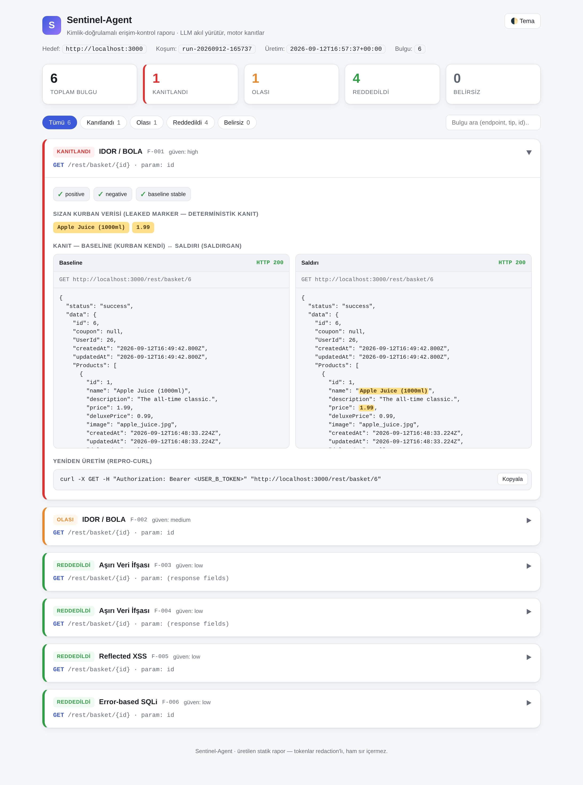

<div align="center">

# 🛡️ Sentinel-Agent

**AI destekli, kanıt-temelli erişim kontrolü (access-control) pentest aracı**

_LLM akıl yürütür — deterministik motor kanıtlar._

[](https://www.python.org/)
[](tests/)
[](docker-compose.yml)
[](https://owasp.org/API-Security/editions/2023/en/0xa1-broken-object-level-authorization/)
[](#lisans)

</div>

---

Sentinel-Agent, kendi web uygulamalarındaki **yetkilendirme açıklarını** (IDOR/BOLA, BFLA, aşırı
veri ifşası ve yazma/silme yetki hataları) bulur — ve her bulguyu **tekrar-üretilebilir kanıtla**
raporlar. İki gerçek kullanıcı hesabıyla oturum açar, birinin diğerinin nesnesine erişip
erişemediğini **differential test** ile ölçer ve sonucu yalnızca deterministik kanıt varsa
`CONFIRMED` işaretler.

> **Neden önemli?** Broken Object Level Authorization (BOLA/IDOR), yıllardır **OWASP API Security
> Top 10'da 1 numara** — ama klasik tarayıcıların (ZAP/Burp) en zayıf olduğu yer, çünkü "kimin nesi
> kimde" sorusunu anlamazlar. Sentinel-Agent tam da bu boşluğu doldurur.

<div align="center">



<sub>Gerçek bir koşumdan üretilen HTML rapor: doğrulama kontrolleri, request/response diff, sızan-marker vurgusu ve redaksiyonlu repro-curl.</sub>

</div>

---

## ✨ Neyle farklı?

Çoğu "AI pentest ajanı" demosu modeli hedefe salar ve model "buldum" der — kanıt yok, determinizm
yok, false-positive riski yüksek. Sentinel-Agent'ın mimarisi bunun tersini garanti eder:

> 🔭 **LLM = keşif kolu (scout):** *neyi* test edeceğini önerir, sonucun ne anlama geldiğini yorumlar.
> ⚖️ **Deterministik motor = hâkim (judge):** açığın gerçek olup olmadığına **her zaman kod** karar verir.

Bu ayrım sayesinde aracın çıktısına güvenilebilir: aynı taramayı iki kez koş, aynı sonucu al; her
`CONFIRMED` bulgunun altında bir güvenlik ekibinin elle doğrulayabileceği kanıt vardır.

### 🔒 İhlal edilemez güvenlik değişmezleri

| # | Değişmez |
|---|---|
| 1 | **LLM ağa asla dokunmaz** — yalnızca tipli aksiyon önerir; tüm trafik tek bir `Replayer`'dan geçer |
| 2 | **`CONFIRMED` kararını her zaman kod verir**, asla LLM — yalnızca deterministik leaked-marker ile |
| 3 | **İki aktör asla session/cookie paylaşmaz** — `test_replay` cross-contamination guard'ı bunu korur |
| 4 | **Kontroller geçmeden verdict yok** — positive + negative + baseline-stability zorunlu |
| 5 | **Scope kapısı her istekte** — allowlist + IP pinning; LLM önerisine güvenilmez |
| 6 | **Redaction zorunlu** — token/cookie/PII log'a, evidence'a, rapora ham yazılmaz |

---

## 🎯 Verdict merdiveni

Her bulgu dört karardan biriyle etiketlenir — belirsizlik **gizlenmez**, açıkça raporlanır:

| Verdict | Anlamı |
|---|---|
| ✅ **CONFIRMED** | Kanıtlı açık: kurbanın özel verisi saldırganın cevabında göründü, veya yazma/silme kurbanın nesnesinde kalıcı etki yaptı |
| 🟡 **LIKELY** | Güçlü belirti var ama kesin kanıt (leaked-marker) doğrulanamadı |
| ⛔ **REJECTED** | Yetki kontrolü çalışıyor — açık yok |
| ❔ **INCONCLUSIVE** | Kontroller geçmedi / oracle emin olamadı — sessizce yanlış yargı vermez, çekimser kalır |

---

## 🧪 Tespit yetenekleri (oracle'lar)

Her açık tipi bir `Oracle` alt sınıfıdır (Open/Closed — yeni tip = yeni sınıf, mevcut kod bozulmaz):

| Oracle | Açık tipi | Kanıt yöntemi |
|---|---|---|
| `IdorOracle` | **IDOR / BOLA** (obje-seviyesi okuma) | leaked-marker: kurbanın verisi saldırganın cevabında |
| `StateChangingOracle` 🆕 | **BOLA-write** (PUT/PATCH/DELETE yetki) | kalıcı mutasyon/silme: işlem sonrası kurban olarak yeniden okuma |
| `BflaOracle` | **BFLA** (fonksiyon-seviyesi yetki) | düşük-yetkili aktör yüksek-yetki fonksiyonuna erişebiliyor mu |
| `BoplaOracle` | **BOPLA** (aşırı veri ifşası) | cevapta görülmemesi gereken hassas alan diff'i |
| `InjectionOracle` | reflected **XSS** + error-based **SQLi** | yansıma / hata-diferansiyeli oracle'ı |

> 🆕 `StateChangingOracle` bu hackathon'da eklendi; `destructive_tests` policy bayrağıyla kapılı ve
> OWASP Juice Shop'a karşı canlı `CONFIRMED` üretmesi doğrulandı (bir kullanıcının başka bir
> kullanıcının sepet öğesini `DELETE` ile silmesi).

---

## 🚀 Tek komutla demo

Kurulum sürtünmesi yok — Docker + Docker Compose yeterli. Aşağıdaki komut hedefi ayağa kaldırır,
kalibrasyon hesaplarını hazırlar, taramayı koşar ve kanıtlı raporu üretir:

```bash
make demo
# make yoksa (ör. Windows / Git Bash):
bash scripts/demo.sh
```

Çıktı:

```
[done] 6 bulgu · 1 CONFIRMED · runs/run-.../
```

Ardından `runs/<run-id>/report.html` dosyasını tarayıcıda aç. `CONFIRMED` bulgusu, `attacker`'ın
`victim`'in sepetini (`/rest/basket/{id}`) okuyabildiğini ve kurbana ait verinin (ürün adı, fiyat)
**sızdığını** deterministik leaked-marker ile kanıtlar. Komut idempotenttir — tekrar koşmak güvenli.

---

## ⚙️ Kurulum ve çalıştırma

**Ön koşul:** Docker + Docker Compose (Windows'ta Docker Desktop, WSL2 backend ile). Repoyu **WSL2
içindeki Linux dosya sistemine** klonla (nedeni: [aşağıda](#-neden-wsl2--docker-takım-için)).

```bash
git clone https://github.com/Hybrid-Translation-Project/Sentinel-Agent.git
cd Sentinel-Agent

docker compose up -d juice-shop            # kalibrasyon hedefi → http://localhost:3000
docker compose run --rm sentinel bash      # bağımlılıklar + Playwright hazır dev kabuğu
#   imaj içinde:  pytest -q   |   python -m scripts.run_scan --help
```

Yerel `venv` ile (Docker'sız) çalışmak için: [DESIGN.md §5](DESIGN.md).

### 🎛️ Kendi hedefine karşı çalıştırma

Aracın ihtiyacı **paralel bir ajan ordusu değil**, en az **iki gerçek kullanıcı hesabıdır** — biri
kurban, biri saldırgan. (Opsiyonel `admin` ile BFLA de test edilir.)

```bash
# 1) Scope: hedefin host/port/path/method allowlist'i
cp config/scope.example.yaml     config/scope.yaml

# 2) Aktörler: en az 2 hesap (token | storagestate | static auth)
cp config/actors.example.yaml    config/actors.yaml

# 3) Endpoint'ler: elle liste, ya da --openapi / --har ile otomatik keşif
cp config/endpoints.example.yaml config/endpoints.yaml

# 4) Taramayı koş (LLM opsiyonel — varsayılan kapalı)
docker compose run --rm sentinel python -m scripts.run_scan \
    --scope config/scope.yaml --actors config/actors.yaml \
    --endpoints config/endpoints.yaml --mode active --out runs/
```

> 💡 İlk denemede `--dry-run` ekle: hiçbir istek göndermeden, policy'nin hangi isteklere
> ALLOW/DENY verdiğini önizlersin.

### CLI referansı (`run_scan.py`)

| Flag | Açıklama |
|---|---|
| `--scope / --actors / --endpoints` | config YAML dosyaları (zorunlu: scope + actors; endpoint kaynağı) |
| `--openapi <spec>` / `--har <file>` | endpoint'leri OpenAPI spec'inden veya tarayıcı HAR export'undan keşfet |
| `--mode passive\|active` | `passive`: yalnızca listele · `active`: gerçek differential test |
| `--dry-run` | istekleri authorize'dan geçir ama **gönderme** (plan önizlemesi) |
| `--loop` | self-improving orchestrator: CONFIRMED bulgudan pivot hipotezler türet |
| `--llm none\|gemini\|ollama\|anthropic` | hipotez/triyaj LLM'i (varsayılan `none` — **LLM'siz de çalışır**) |
| `--enrich` | bulgulara LLM ile severity/impact/remediation ekle (`--llm` gerekir) |
| `--no-bootstrap` | per-actor own-id crawl'ını atla (id'leri config'te verdiysen) |

> 🤖 **LLM zorunlu değil.** Varsayılan `--llm none`; deterministik kural-tabanlı hipotezlerle araç
> tam çalışır ve kanıtlı `CONFIRMED` üretir. LLM yalnızca **kapsamı ve açıklama kalitesini** artırır.

---

## 🏗️ Mimari

```
recon → hipotez → authorize(scope) → replay(actor) → oracle → finding → report
   │        │            │                 │            │          │
 keşif   LLM+kural    güvenlik kapısı   tek choke     3 kontrol   JSON /
                      (LLM'siz, saf)    point (auth)  + leaked-   Markdown /
                                                       marker      HTML
```

**Modüler bağımlılık yönü (tek yönlü):**
`models → policy → net → oracle → auth → evidence → report → scripts(Scanner)`

Her ana bileşen tek sorumluluklu bir sınıf: `PolicyEngine`, `Replayer`, `ResponseNormalizer`,
`SessionStore`, `Oracle`+alt sınıfları, `AuthProvider`+alt sınıfları, `EvidenceStore`,
`Reporter`+alt sınıfları, `Scanner`, `Pipeline`. Bağımlılıklar constructor'dan enjekte edilir
(DI) → testlerde `httpx.MockTransport` ile network'süz doğrulama.

### İnşa sırası

| Aşama | İçerik | LLM? |
|---|---|---|
| **Stage 0** | multi-actor session + replay + differential oracle + policy engine | ❌ |
| **Stage 1** | recon + LLM hipotez + INCONCLUSIVE triyaj + rapor + BFLA/BOPLA/injection | ✅ |
| **Stage 2** | orchestrator state machine + self-improving döngü (CONFIRMED → pivot) | ✅ |

Deterministik omurga (Stage 0) LLM'siz bitirilir; sonra üstüne zekâ konur. Tam mimari ve yol
haritası: **[DESIGN.md](DESIGN.md)**.

---

## 📊 Rapor görüntüleyici

`report.html` bağımlısız, tek dosyalık statik bir sayfadır (`file://` ile de açılır). Gösterir:

- 📋 Bulgu listesi + özet sayaçları (CONFIRMED / LIKELY / REJECTED / INCONCLUSIVE)
- ✔️ Doğrulama kontrolleri (positive / negative / baseline-stable) rozetleri
- 🔍 Baseline ↔ saldırı yanıt **diff'i**, sızan-marker vurgusuyla
- 📎 Kopyalanabilir **repro-curl** (token redaction'lı)
- 🌗 Açık/koyu tema

Herhangi bir `findings.json` dosyasını sürükle-bırak ile de yükleyebilirsin.

---

## 🐳 Neden WSL2 + Docker (takım için)

1. **Reproducibility:** `docker-compose` herkese (Windows/Mac/Linux) **aynı** Python + Playwright + bağımlılık sürümünü verir → "bende çalışıyordu" biter.
2. **WSL2 zaten Docker'ın altında:** kod da WSL2 Linux FS'inde (`~/projects/...`) olmalı; `/mnt/c` üzerinden bind-mount **çok yavaştır** ve dosya-izleme (`inotify`) bozulur.
3. **Prod-benzeri davranış:** Playwright/Chromium ve async network Linux'ta prod gibi davranır.
4. **Takım tutarlılığı:** CRLF/satır sonu, path ve dosya-izni farkları Linux'ta ortadan kalkar.
5. **OneDrive tuzağı:** `.git`/`.venv`/`node_modules` OneDrive-senkronlu klasörde bozulur — repo **OneDrive dışında** olmalı.

---

## 📁 Proje yapısı

```
Sentinel-Agent/
├── DESIGN.md              # tam mimari + MVP planı (tek kaynak)
├── docker-compose.yml     # dev + juice-shop (kalibrasyon hedefi)
├── Dockerfile             # Python 3.11 + Playwright dev imajı
├── Makefile               # `make demo` / `make test`
├── config/                # scope / actors / endpoints — *.example.yaml (gerçekler git-ignore)
├── docs/                  # rapor ekran görüntüsü, AI-kullanımı, Devpost taslağı, video senaryosu
├── src/pentestai/         # models · policy · net · oracle · auth · recon · llm · orchestrator · evidence · report
│   ├── oracle/            # idor · state_change · bfla · bopla · injection (+ base ABC)
│   └── report/            # JSON + Markdown + HTML (statik viewer) reporter'ları
├── tests/                 # authorize / oracle / replay / orchestrator (network'süz, 56 test)
├── runs/                  # tarama çıktıları: findings.json + report.{md,html} (git-ignore)
└── scripts/
    ├── run_scan.py        # CLI
    ├── bootstrap_demo.py  # Juice Shop kalibrasyon hesabı + config üretimi
    └── demo.sh            # tek-komut demo
```

---

## 🧑‍💻 Katkı / takım kuralları

- **Sırları asla commit'leme.** Gerçek parola/token/`storageState` → `.secrets/` (git-ignore'lu). Config'te yalnızca `*.example.yaml`.
- **Commit mesajları Türkçe**, imzasız (`tür: özet`). Detay: [CLAUDE.md](CLAUDE.md).
- **Branch akışı:** `main` korumalı; `feature/...` + PR. Küçük, gözden geçirilebilir PR'lar.
- **Testler yeşil olmadan merge yok** (özellikle `test_replay` cross-contamination guard'ı):
  ```bash
  make test          # veya: docker compose run --rm sentinel pytest -q
  ```

---

## ⚖️ Etik / kapsam uyarısı

Yalnızca **sahibi olduğun veya açık yazılı yetkin bulunan** hedeflerde çalıştır: kendi
localhost/staging uygulaman ya da kalibrasyon için OWASP Juice Shop gibi kasıtlı-zafiyetli
hedefler. Scope/policy engine tüm istekleri allowlist + IP pinning ile denetler ve scope dışına
çıkışı engeller — ama nihai sorumluluk sende.

## 📄 Lisans

TBD (takımla kararlaştırılacak).
