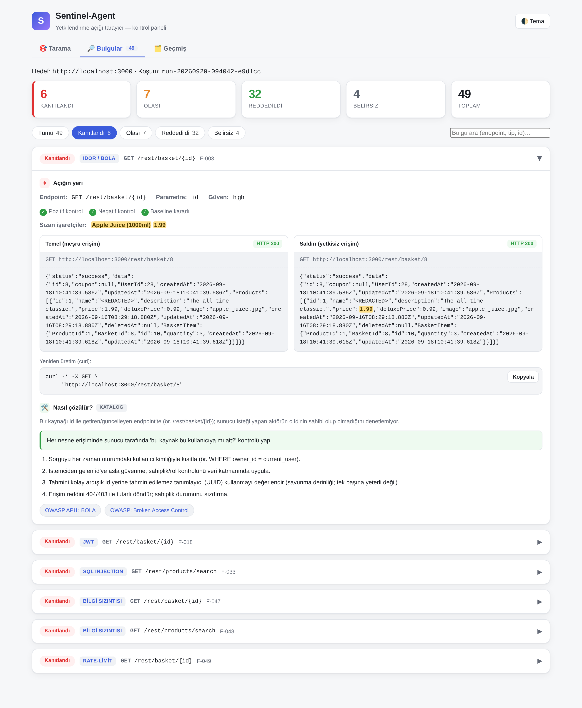
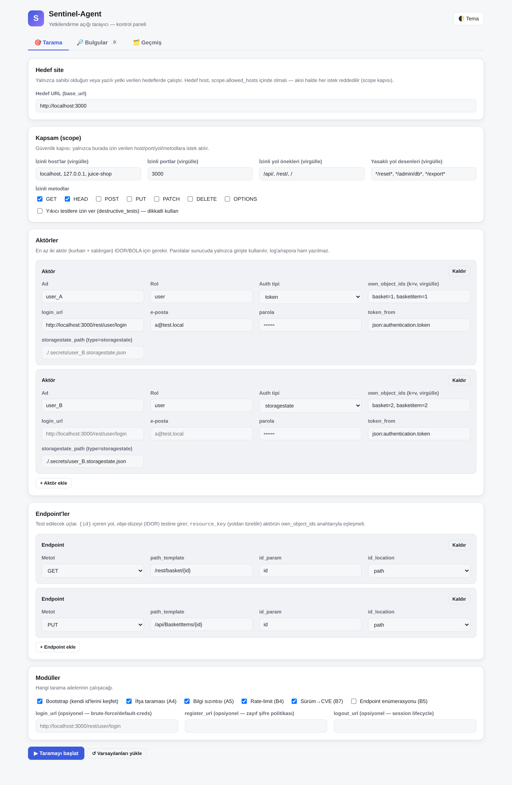

<div align="center">

# 🛡️ Sentinel-Agent

**Evidence-based access-control pentesting — an AI agent that has to prove it.**

_The LLM reasons. A deterministic engine decides._

[](https://www.python.org/)
[](docker-compose.yml)
[-9775fa.svg)](#-the-control-panel)
[](https://owasp.org/API-Security/editions/2023/en/0xa1-broken-object-level-authorization/)
[](LICENSE)

</div>

---

## Try it in one command

```bash
make demo
```

That boots a deliberately vulnerable target, creates two real user accounts, runs the scan and
writes a report you can open in a browser. Then:

```bash
python -m scripts.serve_ui        # → http://127.0.0.1:8787
```

<div align="center">



<sub>A finding in the control panel: the three verification controls, the baseline↔attack response
diff with the leaked marker highlighted, a copy-paste repro <code>curl</code>, and step-by-step
remediation.</sub>

</div>

---

## What it does

Sentinel-Agent finds **broken authorization** in web apps and APIs — IDOR/BOLA, BFLA, excessive
data exposure, unauthorized writes and deletes — plus a range of classic web vulnerabilities. It
logs in as **two real users**, then measures whether one can reach the other's data.

A finding is only marked `CONFIRMED` when the victim's *own private data* is provably present in
the attacker's response. That decision is made by code, never by a language model.

### Why this matters to people who will never read this README

Broken Object Level Authorization has been **#1 on the OWASP API Security Top 10** for years, and
it is the single most boring bug in security: a URL ends in `/orders/1043`, someone types `1044`,
and they are reading a stranger's order. No exploit, no malware — just a number.

In 2019 the title insurance company **First American Financial** exposed roughly **885 million**
documents this way: mortgage paperwork, bank account numbers, wire transfer receipts, Social
Security numbers and driver's licenses, reachable by editing a document ID in a link. Nobody had to
break in. The records of ordinary people buying a house were simply *addressable*.

That is what this tool hunts. Not a theoretical class of bug — the specific path by which a normal
person's orders, medical records and messages end up in someone else's browser.

### What's actually new here

Differential authorization testing is **not** new. [Burp Suite's Autorize extension][autorize] and
[AuthMatrix][authmatrix] have replayed one user's requests as another for years, and the academic
[AuthProbe][authprobe] work is where this project's benchmark methodology comes from. If you want a
mature, general-purpose tool today, use those.

Three things here are ours:

1. **Verdicts come from deterministic evidence, not from a model.** `CONFIRMED` requires a
   *leaked marker* — a value belonging to the victim, provably absent from what the attacker is
   legitimately allowed to see. Uncertainty is reported as `INCONCLUSIVE` rather than smoothed over.
2. **Tamper-evident proof bundles.** Every confirmed finding ships as a portable bundle sealed with
   a SHA-256 integrity hash (optionally HMAC-signed), re-provable offline with no network and no
   model. Hand it to a security team; they can verify you didn't edit it.
3. **An evidence engine other agents can call.** Over [MCP](https://modelcontextprotocol.io),
   another AI agent can stop guessing and ask Sentinel to *prove* a suspicion instead.

[autorize]: https://github.com/PortSwigger/autorize
[authmatrix]: https://github.com/SecurityInnovation/AuthMatrix
[authprobe]: https://arxiv.org/html/2607.20574v1

---

## The verdict ladder

Uncertainty is reported, never hidden:

| Verdict | Meaning |
|---|---|
| ✅ **CONFIRMED** | Proven. The victim's private data appeared in the attacker's response, or a write/delete persisted on the victim's object. |
| 🟡 **LIKELY** | Strong signal, but no deterministic leaked marker. |
| ⛔ **REJECTED** | Authorization works. No vulnerability here. |
| ❔ **INCONCLUSIVE** | Controls failed or the oracle couldn't be sure. It abstains instead of guessing. |

> **This is the point of the project.** An oracle saying "I could not be sure" is not a gap — it is
> the reason the `CONFIRMED` list can be trusted. There is deliberately **no fallback** that
> downgrades an uncertain result into a softer "probably".

### Security invariants (non-negotiable)

| # | Invariant |
|---|---|
| 1 | **The LLM never touches the network.** It proposes typed actions; all traffic goes through one `Replayer`. |
| 2 | **Code decides `CONFIRMED`,** never the LLM — and only on a deterministic leaked marker. |
| 3 | **Two actors never share a session or cookie** — enforced by a cross-contamination test. |
| 4 | **No verdict without controls** — positive, negative and baseline-stability must all pass. |
| 5 | **Scope gate on every request** — allowlist + IP pinning. The LLM's suggestions are not trusted. |
| 6 | **Redaction is mandatory** — tokens, cookies and PII never reach logs, evidence, reports or the UI in raw form. |

---

## 🖥️ The control panel

The panel is the front door; the CLI is underneath it. The server is written against the Python
**standard library** — no extra dependencies — and binds to `127.0.0.1` only.

```bash
python -m scripts.serve_ui                    # → http://127.0.0.1:8787
python -m scripts.serve_ui --port 9000 --out runs/
```

| View | What it does |
|---|---|
| 🎯 **Scan** | Enter target, scope, actors and endpoints in a form; watch the scan run live |
| 🔎 **Findings** | Verdict counters, filter and search; per finding: the evidence, the response diff, the repro curl, and how to fix it |
| 🗂️ **History** | Reopen any previous run from `runs/` with the same detail |

<div align="center">



</div>

**How the panel is kept safe.** It locks scope to a file on disk (default `config/scope.yaml`), not
to whatever the form posts — a submitted scope can only *narrow* it, never widen it. Every request
still passes `PolicyEngine`. A `RequestGuard` rejects unknown `Host` headers (DNS rebinding) and
non-JSON `POST` bodies (CSRF). Passwords are used to log in and never written to logs, reports or
the UI. Binding to `0.0.0.0` requires an explicit `--allowed-host`, or nothing is served at all.

---

## Running it against your own target

What the tool needs is not a swarm of agents — it is **two real accounts**: a victim and an
attacker. (An optional `admin` enables BFLA testing.)

```bash
# 1) scope: host/port/path/method allowlist for the target
cp config/scope.example.yaml     config/scope.yaml

# 2) actors: at least 2 accounts (token | storagestate | static | browser auth)
cp config/actors.example.yaml    config/actors.yaml

# 3) endpoints: list them, or discover with --openapi / --har
cp config/endpoints.example.yaml config/endpoints.yaml

# 4) scan (LLM optional — off by default)
python -m scripts.run_scan \
    --scope config/scope.yaml --actors config/actors.yaml \
    --endpoints config/endpoints.yaml --mode active --out runs/
```

> 💡 Start with `--dry-run`: it shows which requests the policy would ALLOW or DENY without sending
> a single one.

Installed as a CLI (`pip install .`), the same scan is `sentinel scan ...`, and
`--scan-mode quick|standard|deep` scales the budget and breadth.

**Authentication types** (`config/actors.yaml` → `auth.type`):

| Type | When | How |
|---|---|---|
| `token` | Simple login (one `POST` → token in JSON) | `login_url` + `credentials` + `token_location` |
| `static` | You already hold a token/cookie | `headers` / `cookies` directly |
| `storagestate` | SPA/OAuth login — log in manually, export with Playwright | `storagestate_path` (under `.secrets/`) |
| `browser` | SPA/OAuth login + **TOTP MFA** — automates the export step | `login_url` + `credentials` + optional `mfa_totp_secret` |

`browser` only solves **TOTP** MFA; SMS/push are not supported and it fails loudly rather than
producing a silently wrong session.

<details>
<summary><b>Full CLI reference</b></summary>

| Flag | Description |
|---|---|
| `--scope / --actors / --endpoints` | config YAML files (scope + actors required) |
| `--openapi <spec>` / `--har <file>` | discover endpoints from an OpenAPI spec or a browser HAR export |
| `--mode passive\|active` | `passive`: list only · `active`: run the differential test |
| `--scan-mode quick\|standard\|deep` | scales budget + breadth (`quick`≈40 requests/300s) |
| `--dry-run` | authorize requests but **don't send** them |
| `--enumerate` | wordlist endpoint enumeration + GraphQL introspection |
| `--login-url / --register-url / --logout-url` | enables brute-force, weak-password and session-lifecycle checks |
| `--no-exposure-scan / --no-info-leak-scan / --no-rate-limit-scan / --no-cve-scan` | skip a detector family |
| `--loop` | self-improving orchestrator: pivot new hypotheses off a CONFIRMED finding |
| `--agent [--scouts N]` | agentic reasoning loop; parallel scouts share one budget and policy |
| `--llm none\|gemini\|ollama\|anthropic` | hypothesis/triage LLM (default `none`) |
| `--llm-config <file>` / `--llm-model <name>` | LLM settings from a file; CLI flags override it |
| `--enrich` | add severity/impact/remediation prose via LLM (verdict never changes) |
| `--fail-on none\|low\|medium\|high\|critical` | CI gate: exit code 2 at or above this severity |
| `--baseline <previous-findings.json>` | exempt known findings from `--fail-on`; they stay in the report |

</details>

### The LLM is optional — and off by default

Hypotheses are generated from deterministic rules: id-shaped path segments, parameter types read
from OpenAPI/HAR, an id pool learned during an authenticated crawl, and marker candidates inferred
from the response shape. With `--llm none` the tool still produces proven `CONFIRMED` findings. An
LLM only widens coverage and improves the prose.

Local models are supported through Ollama, so target data never leaves the machine:

```bash
ollama pull qwen3.8:27b
python -m scripts.run_scan ... --llm ollama --llm-model qwen3.8:27b --enrich
```

Hypothesis, enrichment and action selection are constrained to a JSON **schema**; anything
off-schema is dropped rather than crashing the scan. `temperature` defaults to `0`.

---

## 📐 Does it actually work?

A claim like "proven, deterministic, low false-positive" is worthless unless it is measured
against **labelled ground truth**. Labels are set by observing the target's real HTTP behaviour,
never by reading the tool's own output — otherwise the measurement is circular.

**One target, 7 labelled cases, run on 2026-09-18 with `--llm none`:**

| Target | Cases | Precision | Recall | FP-rate | TP/FN/FP/TN |
|---|---|---|---|---|---|
| OWASP Juice Shop | 7 (4 positive / 3 negative) | 100% | 100% | **0%** | 4/0/0/3 |

Full output, provenance and the exact reproduction commands:
**[`benchmarks/juiceshop.result.md`](benchmarks/juiceshop.result.md)**.

**Read that number carefully** — the report says this too:

- It covers **7 labelled cases**, not the tool's entire output. The run produced 49 findings, 6 of
  them `CONFIRMED`; two of those are outside the label set and are excluded from the metrics.
- **FP-rate 0%** means none of the 3 negative cases (a public-by-design endpoint, a non-object
  endpoint) was wrongly confirmed. It does **not** mean the tool never produces false positives.
- Juice Shop is a **calibrated** target — the labels were written while looking at it. These
  numbers are optimistic and **do not measure generalization**. That requires a holdout target,
  which this suite does not yet have, and the benchmark report says so rather than pretending
  otherwise.

The methodology follows AuthProbe's **vulnerable ↔ hardened twin** approach: every target carries
both real vulnerabilities and by-design-safe endpoints, so the false-positive rate rests on labels
instead of assumptions.

```bash
make bench-guard     # netless 0-FP regression gate: a false CONFIRMED on a hardened twin fails the build
```

---

## 🏗️ How it works

```
recon → hypothesis → authorize(scope) → replay(actor) → oracle → finding → report
   │         │              │                │            │         │
discovery  rules+LLM   security gate    single choke   3 controls  JSON / Markdown /
                       (no LLM, pure)   point (auth)   + leaked-   HTML / SARIF
                                                        marker
```

Every component is a single-responsibility class with constructor injection, so tests can swap in a
fake transport and run the whole pipeline without a network. Dependencies point one way:

`models → policy → net → oracle → auth → evidence → report → scanner · webui`

| Stage | Contents | LLM? | Status |
|---|---|---|---|
| **Stage 0** | multi-actor sessions, replay, differential oracle, policy engine | ❌ | ✅ complete |
| **Stage 1** | recon, hypotheses, triage, reporting, the oracle/detector families | optional | ✅ complete |
| **Stage 2** | orchestrator state machine, self-improving loop (CONFIRMED → pivot) | optional | ✅ core complete; LLM-driven prioritisation still open |

Architecture in full: **[DESIGN.md](DESIGN.md)**. Development environment and the WSL2/Docker
rationale: **[docs/gelistirme-ortami.md](docs/gelistirme-ortami.md)**.

### Reports

Each run writes `runs/<run-id>/` in several formats, all redacted:

| File | Use |
|---|---|
| `findings.json` | raw findings |
| `report.md` · `report.html` | human summary; the HTML is a single self-contained file |
| `report.sarif` | GitHub code-scanning "Security" tab |
| `junit.xml` · `report.csv` | CI "Tests" tab · spreadsheets |
| `proof/<id>.bundle.json` | **sealed, re-provable** evidence bundle |

```bash
python -m scripts.replay runs/<run-id>       # offline re-proof: PROVEN, or FAILED if tampered with
```

### For other AI agents (MCP)

```bash
pip install -e ".[mcp]"
sentinel-mcp --scope config/scope.yaml --actors config/actors.yaml --endpoints config/endpoints.yaml
```

Tools: `list_actors`, `list_endpoints`, `probe` (discovery, no verdict), `run_oracle`
(authorize→replay→oracle), `reverify` (flakiness elimination). An agent that suspects an IDOR can
call `run_oracle` and receive a deterministic verdict with evidence instead of inventing one. The
MCP client never touches the network, and every result is redacted.

### Roadmap

Agent-security predicates for LLM/MCP targets, a community YAML template ecosystem, release
integrity verification, and holdout-based generalization measurement all exist in the codebase and
are documented in [DESIGN.md](DESIGN.md) and
[docs/rakip-analizi-agent-security-2026-09.md](docs/rakip-analizi-agent-security-2026-09.md).

---

## Detection coverage

<details>
<summary><b>Oracles — comparative, evidence-based (click to expand)</b></summary>

| Oracle | Vulnerability | Evidence |
|---|---|---|
| `IdorOracle` | **IDOR / BOLA** | leaked marker: the victim's data in the attacker's response |
| `StateChangingOracle` | **BOLA-write** (PUT/PATCH/DELETE) | persistent mutation, re-read as the victim |
| `BflaOracle` | **BFLA** | can a low-privilege actor reach a high-privilege function |
| `BoplaOracle` | **BOPLA** / excessive data exposure | sensitive fields that shouldn't be in the response |
| `UnauthorizedAccessOracle` | unauthenticated access | can an anonymous session reach a protected resource |
| `MethodBypassOracle` | authorization bypass via HTTP method | method/override-header tricks past the gate |
| `MassAssignmentOracle` | mass assignment | did a privileged field (`role`, `isAdmin`) persist |
| `CsrfOracle` | **CSRF** | does a state-changing request pass without anti-CSRF protection |
| `FileUploadOracle` | unsafe upload | is a dangerous type/extension accepted and served |
| `StoredXssOracle` | **stored XSS** | store→retrieve: script returned unencoded to another actor |
| `InjectionOracle` | **XSS · SQLi · NoSQLi · SSTI · path traversal** | reflection / error differential / template evaluation |
| `TimingOracle` | blind injection | measured delay differential |
| `UntrustedToActionOracle` | **untrusted content → privileged action** | structural overlap between untrusted tool output and the next privileged call |

</details>

<details>
<summary><b>Detectors — single-request signature and behaviour (click to expand)</b></summary>

| Detector | Vulnerability (OWASP) |
|---|---|
| `ExposureScanner` | exposed files/endpoints: `.env`, `.git`, backups, swagger, directory listings (A05) |
| `InfoLeakDetector` | stack traces, version fingerprints, internal IPs, SQL error signatures (A05) |
| `RateLimitDetector` | missing rate limits, brute force, weak password policy (A07) |
| `VersionCveDetector` | version → known CVE mapping (A06) |
| `DefaultCredentialsDetector` | default credentials (safe try-list) |
| `SessionLifecycleDetector` | token valid after logout, JWT `exp`, session fixation |
| `OpenRedirectDetector` · `CorsDetector` | open redirect · CORS misconfiguration |
| `SecurityHeadersDetector` | missing security headers, clickjacking |
| `JwtDetector` | `alg=none`, weak signature, `exp` problems |
| `SsrfDetector` · `XxeDetector` · `RfiDetector` | SSRF / XXE / RFI, in-band **and** blind (OOB collector) |
| `PrototypePollutionDetector` · `CacheDetector` | prototype pollution · web cache poisoning |
| `UserEnumDetector` | user enumeration |
| `WordlistRecon` · `GraphQLRecon` | endpoint enumeration · GraphQL introspection |

</details>

<details>
<summary><b>Agent-security predicates — when the target is an LLM agent (click to expand)</b></summary>

When the target is an LLM agent or MCP server rather than an HTTP API, the same discipline applies
to its observed tool-call trace. Code still decides; the model gets no vote.

| Predicate | Deterministic evidence |
|---|---|
| **CONFUSED_DEPUTY** | a side-effecting call succeeded **without the user asking for it** |
| **DESTRUCTIVE_WRITE** | a write/delete targeted a **protected** resource (behind a `destructive_tests` gate) |
| **EXFILTRATION** | a synthetic **canary** secret appeared in an outbound call — including base64/hex/url/reversed encodings |
| **UNTRUSTED_TO_ACTION** | untrusted content (web/email) triggered a privileged action |

False-positive traps are first-class: if the user explicitly asked for the action, confused deputy
is `REJECTED`; if the canary came from the user's own input, it isn't exfiltration. The canary
value is never written to the report in any encoding.

</details>

---

## 🧑‍💻 Contributing

```bash
pytest -q          # netless unit tests — must be green before merge
make lint          # ruff
make verify        # release integrity: manifest hashes, AST parse, report arithmetic, links
```

Secrets are never committed (`.secrets/`, git-ignored); only `config/*.example.yaml` is tracked.
Commit messages and internal docs are in Turkish by team convention — see
[CLAUDE.md](CLAUDE.md). Anything jury- or user-facing is in English.

---

## ⚖️ Ethics and scope

Run this **only** against targets you own or have explicit written authorization to test: your own
localhost/staging application, or a deliberately vulnerable target like OWASP Juice Shop. The
scope and policy engine checks every request against an allowlist with IP pinning and blocks
anything outside it — but the final responsibility is yours.

## 📄 License

[Apache License 2.0](LICENSE) — permissive with a patent grant. Contributions are made under the
same license ([LICENSE](LICENSE) §5).

## 🔒 Reporting a vulnerability

Found a security bug **in this tool**? See [SECURITY.md](SECURITY.md) — please use GitHub's private
reporting flow rather than opening a public issue.
